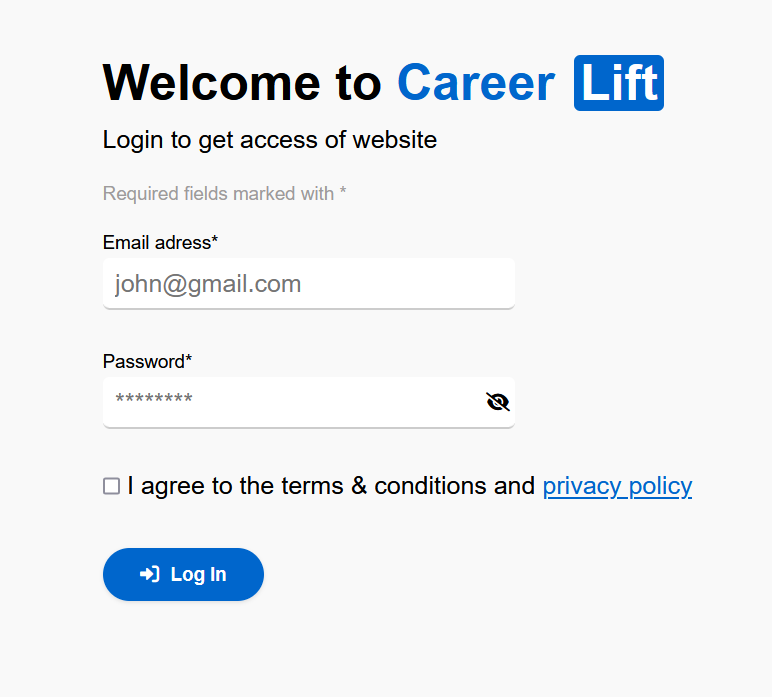

# Career Lift 🌟

Welcome to **Career Lift**, a platform designed to empower your professional journey by connecting you to your network, showcasing your profile, and enabling job opportunities. 🚀

---

## 🌐 Live Demo
Check out the live version of Career Lift [here](https://gur512.github.io/career-lift/).


---

## 📂 Project Structure

The project is built with the following structure:

---

## ✨ Features

- **User Authentication**: Login functionality with email and password validation.
- **Networking Options**: View and interact with user profiles, including followers and connections.
- **Content Sharing**: Create posts, share articles, upload images, and videos.
- **Interactive Feed**: Like, comment, and share posts from the community.
- **Dynamic Suggestions**: Stay updated with curated suggestions in the sidebar.

---

## 🛠️ Built With

- **HTML5**: Semantic markup for accessibility and structure.
- **CSS3**: Custom styles with external libraries like Font Awesome.
- **JavaScript**: For interactive elements and dynamic content.
- **Google Fonts**: Open Sans for a professional aesthetic.

---

## 🚀 Getting Started

### Prerequisites
Ensure you have the following installed:
- A modern web browser
- A text editor (e.g., VS Code)

### Setup
1. Clone the repository:
   ```bash
   git clone https://github.com/Gur512/career-lift.git

# Team 🤝

- **Gurpreet Kaur 🚀**
- **Rahaf A.K 🌟**


License 🔒
This project is licensed under the MIT License. See the LICENSE file for details.

